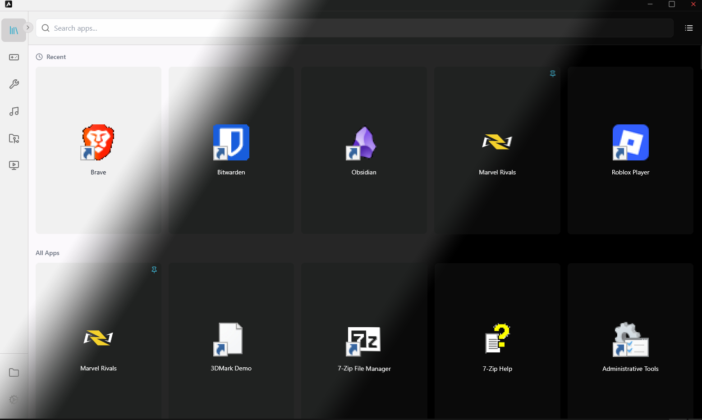

# Axon


Axon is a sleek and modern application launcher for Windows, built with Tauri, React, and Rust. It provides a fast and customizable way to access and organize your applications.

## ✨ Features

*   **Application Discovery:** Automatically scans your Start Menu to find installed applications.
*   **Customizable Interface:**
    *   Light and Dark themes.
    *   Grid or list view for applications.
    *   Custom application icons.
*   **Organization:**
    *   Categorize applications.
    *   Create folders to group apps.
    *   Pin your favorite apps.
*   **Fast Search:** Quickly find applications with the built-in search bar.
*   **System Tray Integration:** Runs in the system tray for easy access.

## 🛠️ Tech Stack

*   **Framework:** [Tauri](https://tauri.app/)
*   **Frontend:** [React](https://reactjs.org/), [TypeScript](https://www.typescriptlang.org/), [Vite](https://vitejs.dev/)
*   **Styling:** [Tailwind CSS](https://tailwindcss.com/)
*   **State Management:** [Zustand](https://github.com/pmndrs/zustand)
*   **Backend:** [Rust](https://www.rust-lang.org/)

## 🚀 Getting Started

### Prerequisites

*   [Node.js](https://nodejs.org/en/)
*   [Rust](https://www.rust-lang.org/tools/install)
*   [Tauri Prerequisites](https://tauri.app/v1/guides/getting-started/prerequisites)

### Installation & Development

1.  **Clone the repository:**
    ```bash
    git clone https://github.com/your-username/axon.git
    cd axon
    ```

2.  **Install frontend dependencies:**
    ```bash
    npm install
    ```

3.  **Run the development server:**
    ```bash
    npm run tauri dev
    ```

### Building for Production

To build the application for production, run:

```bash
npm run tauri build
```

This will generate an installer in `src-tauri/target/release/bundle/`.

## 🖼️ Screenshots

<!-- Add your screenshots here. -->
<!-- Example:  -->


## 📄 License

This project is licensed under the MIT License.